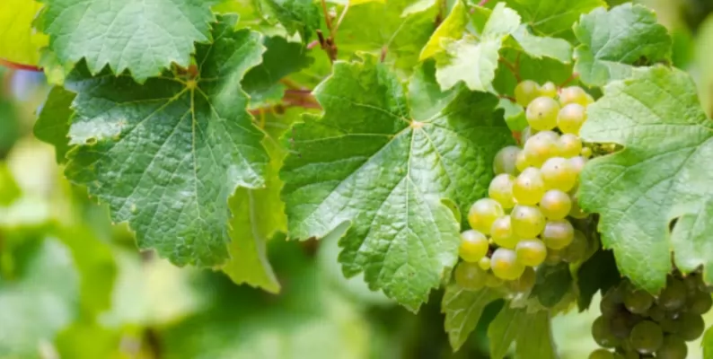

## Body

（Agricultural Product）Grape Leaf Image Dataset

Kirkuklu, Urunlusen, Ozkan, Aslan, Sabanci (2022). Deep Features-Based Convolutional Neural Networks and Support Vector Machine Classification for Grapevine Leaf Classification. Journal of Measurement, 188(11), 110425. DOI: https://doi.org/10.1016/j.measurement.2021.110425

Highlights:
• A five-class classification of grapevine leaves based on the MobileNetv2 convolutional neural network model.
• Feature classification using different kernel functions of Support Vector Machines.
• Implementation of a feature selection algorithm to improve classification accuracy.
• Three-fold CNN-SVM model classification to achieve the highest accuracy.
Abstract: The main product of the grapevine is fresh consumption or processed grapes. Additionally, grapevine leaves are harvested once a year as by-products. The variety of grapevine leaves has importance in terms of price and taste. In this study, grapevine leaf images were used for deep learning-based classification. To this end, images of 500 leaves belonging to 5 varieties were captured using a special self-illumination system. This number was then increased to 2500 through data augmentation methods. Classification was performed using the state-of-the-art CNN model (fine-tuned MobileNetv2). As a second method, features were extracted from the Logits layer of pre-trained MobileNetv2 and classified using various SVM kernels. As a third method, 1000 features were extracted from the Logits layer of MobileNetv2, reduced through chi-square test, and down to 250. Then, selected features were used with various SVM kernels for classification. The most successful method was extracting features from the Logits layer and reducing them through chi-square test. The most successful SVM kernel was the cubic polynomial kernel. The classification accuracy of this system was determined to be 97.60%. It was observed that feature selection improved classification accuracy, even though the number of features used for classification decreased.
Keywords: Deep Learning, Transfer Learning, Support Vector Machines, Grapevine Leaf Images, Leaf Recognition

## Images

item_1024541171754

Here is a pay link on Stripe ( https://buy.stripe.com/3cs8yP7sY87d0vu9AB ). Please contact me lonlonago@foxmail.com after funding $89, and I will send you a complete data files , thank you!

